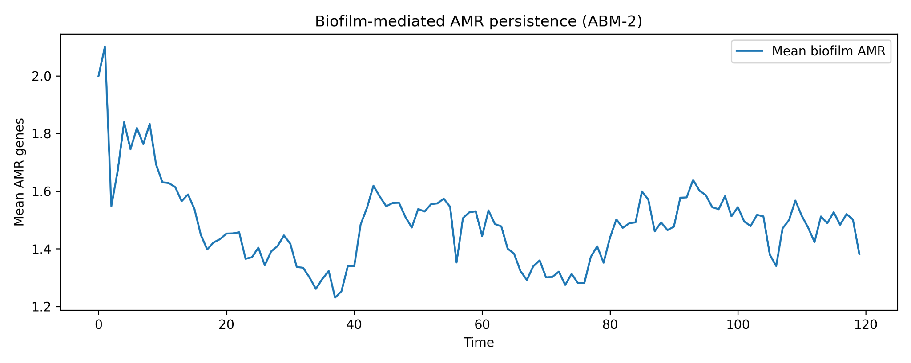
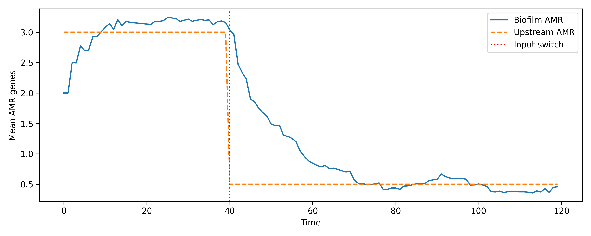
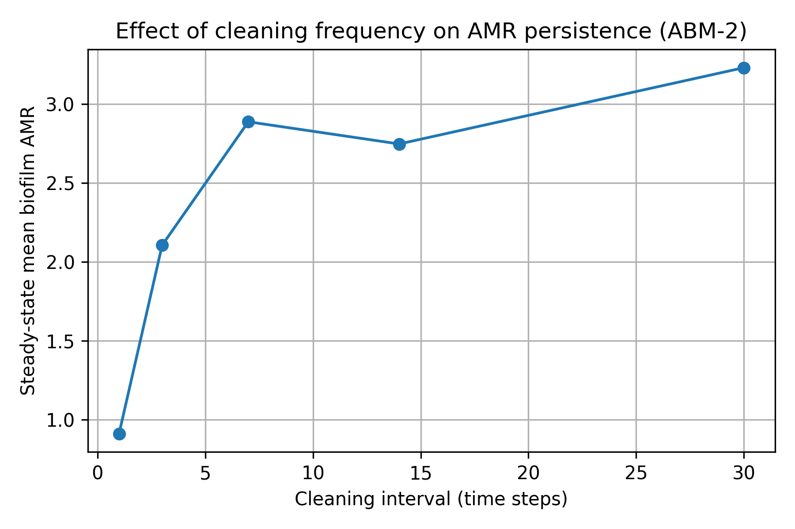
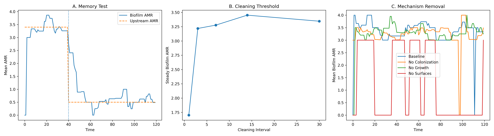

# Milk Supply Chain AMR Persistence Model

Agent-based model for investigating biofilm-mediated antimicrobial resistance (AMR) persistence in dairy supply chain infrastructure.

## Overview

This repository contains the code for an Agent-Based Model (ABM-2) developed to investigate the persistence of antimicrobial resistance within biofilm-associated dairy supply chain infrastructure.

The model focuses on downstream persistence on milk-contact surfaces, including storage, transport, and processing infrastructure. It examines how biofilm formation, bacterial colonization, growth, shedding, and cleaning influence the persistence of AMR over time.

The model complements a separate upstream model (ABM-1) that investigates AMR emergence during milk production and aggregation.

## Model Structure

The model represents milk-contact infrastructure as surface agents. Each surface agent can:

* Receive bacterial colonization from incoming milk.
* Accumulate biofilm biomass.
* Maintain an associated AMR burden.
* Grow biofilm biomass over time.
* Shed a fraction of biofilm biomass.
* Undergo periodic cleaning that reduces biofilm biomass.

The model tracks mean biofilm AMR and total biofilm biomass over simulation time.

## Experiments

The repository includes scripts for three main experimental components:

### 1. Biofilm Persistence

The baseline model simulates AMR persistence within biofilm-associated surfaces under a defined upstream AMR distribution and cleaning regime.

### 2. Memory Experiment

The upstream AMR distribution is changed from a high-AMR condition to a low-AMR condition during the simulation.

This experiment examines whether biofilm-associated AMR declines immediately or persists after the upstream AMR burden is reduced.

### 3. Cleaning Threshold Experiment

Different cleaning intervals are tested to examine their relationship with steady-state biofilm AMR.

The tested cleaning intervals are:

* 1 time step
* 3 time steps
* 7 time steps
* 14 time steps
* 30 time steps

### 4. Mechanistic Validation

The validation script evaluates:

* Memory/persistence following upstream AMR reduction.
* Cleaning-dependent persistence.
* Model behavior under mechanism-removal scenarios.

## Model Outputs

The repository includes PNG figures generated from the model simulations.

### Biofilm AMR Persistence



### Memory Experiment



### Cleaning Threshold



### Mechanistic Validation



## Repository Files

| File                               | Description                                                 |
| ---------------------------------- | ----------------------------------------------------------- |
| `model.py`                         | Main ABM-2 model implementation                             |
| `model_scen2.py`                   | Extended model used for scenario and validation experiments |
| `surface_agent.py`                 | Surface agent representing milk-contact infrastructure      |
| `run.py`                           | Baseline biofilm persistence simulation                     |
| `run_scen2.py`                     | Upstream AMR reduction / memory experiment                  |
| `cleaning threshold experiment.py` | Cleaning interval and steady-state AMR experiment           |
| `abm2_phase1_validation.py`        | Combined mechanistic validation experiments                 |
| `figures/`                         | PNG figures generated from model simulations                |
| `LICENSE`                          | MIT License                                                 |

## Software Requirements

The model is implemented in Python using the Mesa agent-based modeling framework.

Required Python packages include:

* Python
* Mesa
* NumPy
* Matplotlib

The exact package versions used for the software release should be specified in `requirements.txt` when available.

## Running the Model

Clone or download this repository and install the required Python packages.

The main scripts can then be run using Python.

For example:

```bash
python run.py
```

The memory experiment can be run using:

```bash
python run_scen2.py
```

The cleaning threshold experiment can be run using:

```bash
python "cleaning threshold experiment.py"
```

The mechanistic validation experiments can be run using:

```bash
python abm2_phase1_validation.py
```

The scripts generate PNG figures in the working directory.

## Reproducibility

The model parameters and experimental settings used in the associated study are provided directly in the Python scripts.

The simulations use stochastic processes, and therefore individual simulation runs may produce different trajectories.

## Relationship to the Associated Study

This software was developed as part of research investigating antimicrobial resistance in the dairy supply chain in Pakistan.

The associated study combines laboratory-based investigation with agent-based modeling approaches to examine AMR emergence and persistence in milk-associated systems.

The manuscript refers to this model as **ABM-2**.

## Citation

### Associated Research Article

Fiaz, M.T., M.H. Mushtaq, F. Awan and A. Riaz (2026). Detection of Multidrug Resistant Milk Associated Psychrotrophic *Pseudomonas* spp. Using Lab Based and Agent Based Modeling Approaches in Pakistan. *Journal of Animal and Plant Sciences*.

The article DOI will be added after publication.

### Software

Fiaz, M.T. and F. Awan (2026). *Milk Supply Chain AMR Persistence Model* (Version v1.0.0). Zenodo. https://doi.org/10.5281/zenodo.22836624


## Code Use and Attribution

If this software contributes to research, publications, presentations, or other academic work, please cite the software and the associated research article.

## License

This project is released under the MIT License. See the `LICENSE` file for details.

## Authors

Muhammad Tulat Fiaz
Furqan Awan

University of Veterinary and Animal Sciences, Lahore, Pakistan
